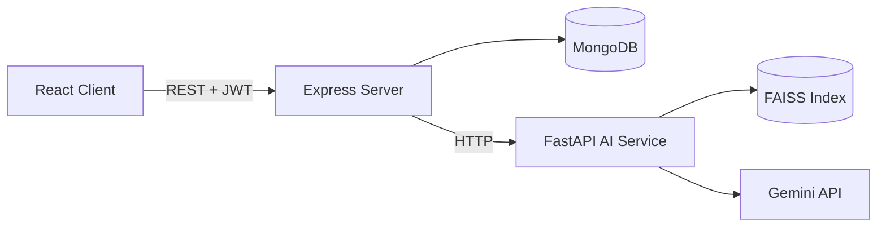

<div align="center">

# DevDocs AI

**Upload technical PDFs. Ask questions. Get answers grounded in your documents.**


[Live Demo](https://dev-docs-ai-five.vercel.app/login) · [Demo Video](#) · [Report a Bug](https://github.com/arka562/DevDocsAI/issues)

<br />


</div>

---

## Overview

DevDocs AI is a RAG (Retrieval-Augmented Generation) app for developer documentation.

- **You upload** a PDF (API docs, manuals, specs)
- **It indexes** the text into a vector database
- **You ask** a question in chat
- **It answers** using only the retrieved parts of your documents, and shows which document the answer came from

---

## Features

| | Feature | Details |
|---|---|---|
| 🔐 | **Authentication** | Register and login with JWT, passwords hashed with bcrypt |
| 📄 | **PDF ingestion** | Text extraction, cleaning, overlapping chunks, embeddings |
| 🔎 | **Semantic search** | FAISS vector index, top 5 chunks per question |
| 💬 | **RAG chat** | Answers limited to retrieved context, with follow-up memory (last 4 messages) |
| 📚 | **Source citations** | Each answer lists the documents it used |
| 🗂️ | **Conversation history** | Saved chats, rename on first message, delete anytime |
| ⏳ | **Processing status** | Each document shows processing, completed or failed |
| 📊 | **Dashboard** | Document count, question count, recent chats |
| 🎨 | **Rich answers** | Markdown rendering with syntax-highlighted code |

---

## Architecture



The browser never talks to the AI service directly. Express handles auth and saved data, then forwards AI work to FastAPI.

**Ingestion flow**

```
PDF -> extract text (pypdf) -> clean -> chunk (500 words, 50 overlap)
    -> embed (Gemini) -> store in FAISS + metadata
```

**Question flow**

```
Question -> embed -> top 5 chunks from FAISS
         -> prompt (context + recent history) -> Gemini -> answer + sources
```

---

## Tech Stack

| Layer | Tools |
|---|---|
| Frontend | React 19, Vite, Tailwind CSS, React Router, Axios, react-markdown |
| Backend | Node.js, Express 5, Mongoose, JWT, bcrypt, Multer |
| AI Service | Python, FastAPI, pypdf, FAISS, Google Gemini |
| Database | MongoDB |

---

## Getting Started

**Requirements:** Node 18+, Python 3.10+, MongoDB (local or Atlas), a Google Gemini API key.

**1. Clone**

```bash
git clone https://github.com/arka562/DevDocsAI.git
cd DevDocsAI
```

**2. AI service** (port 8000)

```bash
cd ai_service
python -m venv venv
venv\Scripts\activate          # Mac/Linux: source venv/bin/activate
pip install -r requirements.txt
cp .env.example .env           # set LLM_API_KEY
uvicorn app.main:app --reload --port 8000
```

**3. Server** (port 5000)

```bash
cd server
npm install
cp .env.example .env           # set MONGO_URI and JWT_SECRET
npm run dev
```

**4. Client** (port 5173)

```bash
cd client
npm install
npm run dev
```

Open `http://localhost:5173`, register, upload a PDF, wait for status **completed**, then ask a question in Chat.

**Environment variables**

| File | Variable | Purpose |
|---|---|---|
| `ai_service/.env` | `LLM_API_KEY` | Gemini API key |
| `server/.env` | `PORT` | API port (default 5000) |
| `server/.env` | `MONGO_URI` | MongoDB connection string |
| `server/.env` | `JWT_SECRET` | Secret for signing tokens |
| `server/.env` | `AI_SERVICE_URL` | AI service address (default `http://localhost:8000`) |

---

## API

**Express (`/api`)**

| Method | Endpoint | Description |
|---|---|---|
| POST | `/auth/register` | Create account |
| POST | `/auth/login` | Login, returns token |
| GET | `/auth/me` | Current user |
| GET | `/documents` | List your documents |
| POST | `/documents/upload` | Upload a PDF |
| GET / DELETE | `/documents/:id` | View or delete a document |
| GET / POST | `/chat/conversations` | List or create chats |
| GET / DELETE | `/chat/conversations/:id` | Get messages or delete a chat |
| POST | `/chat/conversations/:id/messages` | Ask a question |
| GET | `/stats` | Dashboard numbers |

**FastAPI (`/ai`)**

| Method | Endpoint | Description |
|---|---|---|
| POST | `/process-document` | Extract, chunk, embed and index a PDF |
| POST | `/retrieve` | Raw vector search |
| POST | `/chat` | Full RAG answer |

---

## Project Structure

```
DevDocsAI/
├── client/                 # React app (pages, auth context)
├── server/                 # Express API
│   ├── controllers/
│   ├── models/             # User, Document, Conversation, Message
│   ├── routes/
│   └── middleware/
└── ai_service/             # FastAPI RAG pipeline
    └── app/
        ├── routes/
        └── services/       # chunker, embeddings, vector_store, rag, llm
```

---

## Known Limitations

- One shared vector index for all users, not one per user
- Deleting a document removes it from the database but not from the vector index
- Citations show document names only, not page numbers
- No streaming: the full answer is generated before it is shown
- Chunking uses word count, not a real tokenizer
- No reranking or hybrid search
- API URL is hardcoded to `localhost:5000` in the client

## Roadmap

- [ ] Per-user vector isolation
- [ ] Remove deleted documents from the index
- [ ] Page-level citations
- [ ] Streaming responses
- [ ] Deploy with environment-based API URL

---

## Author

**Arkaprava Ghosh**
[GitHub](https://github.com/arka562) · [LinkedIn](#) · [Email](mailto:your@email.com)
